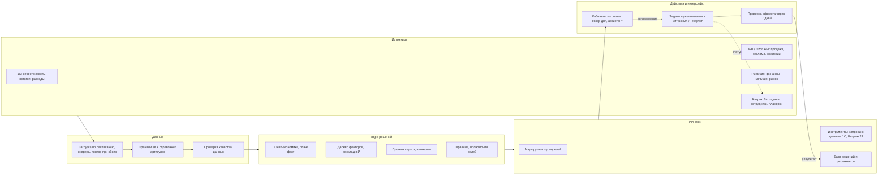

# Корпоративная AI-платформа «Натур Пласт» — концепция и прототип

**Денис Кажаев**, AI-инженер · Telegram [@den_kxcv](https://t.me/den_kxcv) · октябрь 2026

### ▶ [Открыть прототип платформы](https://electrocow0-tech.github.io/decision-center-demo/)

В прототипе можно пройти всё мышкой: обзор дня, разбор отклонения до причины, согласование и задачу в Битрикс24, проверку эффекта, цепочку причин со ссылками в РНП, РНП и план по выручке, остатки и подсорт, финансы (ОПиУ, фин план, оборотный капитал, ДДС, юнит-экономика), рынок и конкурентов, отделы и планёрки, ассистента, переключение ролей. У каждого блока есть пояснение, а данные условные.

**О себе в контексте задачи:** знаю, как устроена работа селлера на маркетплейсах: процессы, метрики, воронку и конверсии. Понимаю, как анализировать статистику продаж, от чего зависят показатели и на что они влияют.

---

## За что здесь платить

Цифры у вас уже есть: кабинеты WB и Ozon, TrueStats, MPStats, таблицы. Платить за ещё одну панель с цифрами смысла нет. Ценность в ответе на два вопроса: **почему это произошло и что сделать**. Платформа отвечает на них за минуты и потом доказывает, что ответ был верным.

### 1. «Почему и что делать» вместо «что произошло»
Каждое отклонение система разбирает до первопричины и выражает в рублях:

> маржа контейнера **−184 тыс. ₽ за неделю** = реклама −97 тыс. (конкурент снизил цену на 12% → карточка ушла с 6-го на 19-е место → CTR 4,1 → 2,3% → цена клика выросла → ДРР 18 → 35%) + невыкуп −51 тыс. (объём в карточке не совпадает, 63% возвратов «не тот размер») + прочее −36 тыс.

Под причиной сразу стоит действие с прогнозом: «снизить ставку и перенести бюджет: +58 тыс. ₽/нед; исправить объём и фото: +34 тыс. ₽/нед». Согласование в один клик, задача уходит в Битрикс24.
**Что это даёт:** руководитель не сводит таблицы и не строит гипотезы. Путь от проблемы до решения сокращается с нескольких дней до часов; цель пилота — с ~6 дней до 1–2.

### 2. Цифры считает код, а ИИ объясняет
ИИ-инструменты для аналитики чаще всего подводят в одном месте: модель выдумывает числа, и после первой ошибки ей перестают верить. Здесь каждая цифра посчитана кодом по вашим данным, а языковая модель только ведёт расследование и формулирует вывод. Любое звено цепочки открывается в РНП на исходной строке и в нужных днях.
**Что это даёт:** выводу можно доверять и проверить его за минуту. Модель можно сменить, в том числе на локальную на вашем сервере, без переделки системы.

### 3. Через 7 дней система проверяет, сработало ли решение
По каждому принятому решению платформа сравнивает факт с прогнозом и записывает вердикт: сработало, частично или нет. Так складывается база решений компании: что у вас работает, а что нет. Среди российских сервисов для селлеров такого цикла я не нашёл.
**Что это даёт:** эффект платформы измерен в рублях, а не обещан. Каждое удачное решение становится кейсом, а система со временем предлагает то, что уже доказало эффект именно у вас.

### Что вы получите через 4 недели пилота
WB, 20–30 ключевых товаров. Ежедневный «Обзор дня» и РНП без ручных таблиц, разборы отклонений до причины в рублях, задачи в Битрикс24 и отчёт пилота: сколько потерь и возможностей найдено (в ₽), сколько предложений принято, насколько быстрее принимаются решения. По этим цифрам вы решаете, развивать ли платформу дальше.

**Как устроено:** учёт, задачи и источники берём готовыми (1С, Битрикс24, TrueStats, MPStats, API WB/Ozon). Своё — только **ядро решений**: единая модель данных, поиск причин в рублях, полномочия ролей, контроль исполнения и измерение эффекта.

---

## Чем ещё платформа отличается

**Вся работа селлера в одном месте.** РНП, план по выручке с расчётом воронки, остатки и подсорт по размерам и складам, сезонность, финансы (ОПиУ, фин план, оборотный капитал, ДДС, юнит-экономика — с нормативами статей), рынок и конкуренты. Всё работает на одних данных и связано ссылками: из отклонения можно перейти к причине, из причины — к исходной цифре.

**Роли и полномочия.** Менеджер сам применяет действия в пределах лимита, крупное уходит на согласование руководителю. Каждый видит свои данные.

**Ваш контур.** Платформу можно развернуть на вашем сервере вместе с локальной моделью, тогда данные не уходят наружу. Все найденные сервисы для селлеров облачные.

### Принципы разбора

1. **Решение принимает человек.** Система готовит разбор с доказательствами: каждое звено цепочки ведёт на исходные цифры, каждое число считает код, а не языковая модель.
2. **Действие выводится из причины, а не из симптома.** Если доля ФОТ выросла из-за падения выручки, задача — вернуть выручку, а не сокращать людей.
3. **У каждого разбора есть уверенность и альтернативные версии.** Система показывает, какие ещё причины проверила и по какому показателю отклонила.
4. **Менеджер сначала пишет свою версию, потом открывает разбор системы.** Так растёт квалификация команды, а не зависимость от готовых ответов.
5. **Точность разборов измеряется вердиктами** («верен / частично / неверен») и показывается руководителю; неверные разборы уходят в пересмотр библиотеки паттернов.

### Что есть в прототипе

| Раздел | Зачем |
|---|---|
| Обзор дня | За 5 минут увидеть главное: отклонения и возможности, отсортированные по влиянию в ₽ |
| Разбор + цепочка причин | За минуты понять причину и принять решение; каждое звено ведёт в РНП на исходные цифры |
| РНП | Видеть каждый день по каждой карточке, где воронка отклонилась от плана, без ручных таблиц; личный вид у каждого менеджера |
| Планирование (год → квартал → месяц) и план по воронке | Цель года раскладывается по месяцам с учётом сезонности и сверяется с прогнозом снизу вверх: виден разрыв и чем его закрыть, сколько нужно закупить, денег и рекламного бюджета по месяцам. План месяца раскладывается на показы, CTR, конверсии, CRO, а система показывает самый дешёвый рычаг |
| Остатки и подсорт | Не терять продажи из-за дефицита и не держать деньги в лишнем товаре: светофор срочности, размеры, склады, «денег в товаре» |
| Сезонность | Закупать и грузить к началу сезона рынка: сравнение сезона рынка и компании, где опаздываем и сколько упускаем |
| Финансы | ОПиУ за месяц и за 12 месяцев с нормативами и «почему»; фин план со сценариями, прогнозом выполнения и анализом чувствительности; оборотный капитал по SKU (запасы, дебиторка площадок, кредиторка); ДДС по трём видам деятельности с графиком кредитов и минимумом кассы; юнит-экономика по SKU до маржи в ₽/шт |
| Рынок | Связь действий конкурентов с вашими продажами, аудит карточек, темы из отзывов |
| Отделы | План/факт отделов, оценка отчётов, исполнение решений планёрок |
| Решения и эффект | Что сработало, а что нет: база решений компании |
| Ассистент | Ответ на любой вопрос по данным за секунды, с учётом прав и с источниками |

**История данных площадок** копится в хранилище платформы с первого дня и не теряется, когда API площадки перестаёт её отдавать (WB отдаёт воронку по дням за 7 дней, Ozon без Premium — за 3 месяца).

---

## 1. Ваше видение → как его закрывает платформа

| Что должна делать платформа | Как это реализуется | Где в прототипе |
|---|---|---|
| Объединять данные Битрикс24, 1С, TrueStats, WB, Ozon | Хранилище с ежедневной загрузкой, справочник соответствия артикулов WB/Ozon ↔ номенклатура 1С, ночная проверка качества данных | «Источники данных» |
| Показывать состояние бизнеса и причины отклонений | «Обзор дня» + дерево факторов: изменение маржи раскладывается на вклад цены, комиссии, логистики, рекламы, невыкупа, себестоимости в ₽ | «Обзор дня», «РНП», «Разбор» |
| Выявлять риски, несоответствия, точки роста | Правила и модели аномалий; несоответствия: 1С ↔ кабинеты, план ↔ факт, отчёт отдела ↔ данные | Карточки «Риск / Возможность / Контроль задачи», «Рынок» |
| Помогать принимать решения по фактам | Каждый вывод показывает ход проверки и источники; предложение с прогнозом эффекта и похожими прошлыми случаями | «Разбор» |
| Запускать согласованные сценарии, действия, уведомления | Согласование → задача в Битрикс24 / уведомление; в пределах полномочий действие применяется сразу | Кнопки «Согласовать», «Применить сам» |
| Учитывать роли и доступы | Роли с разными данными и полномочиями (лимиты ставок, цены, бюджета) | Переключатель ролей |
| Оценивать отчёты, планёрки, эффективность отделов, давать рекомендации по масштабированию | Сценарий 4 (ниже): план/факт отделов, оценка отчётов, протокол планёрки → задачи → контроль | «Отделы» |
| Фиксировать эффект в деньгах, времени, качестве, скорости | База решений: прогноз → факт через 7 дней → вердикт; сводка эффекта внедрения | «Решения и эффект» |

---

## 2. Ориентиры

**Ориентир 1. Корпоративная платформа учёта автопарка с AI-обработкой документов**. Это мой личный опыт: я спроектировал и внедрил платформу. ~120 пользователей, 7 месяцев в эксплуатации.

- **Что делает.** Сводит данные водителей, операторов, топливных карт и 1С:УАТ в одну платформу с ролями. Правила в коде и LLM проверяют отчёты, находят расхождения по топливу и пробегу и отправляют ответственному с указанием причины, а критичные — алертом. LLM дозаполняет данные и формирует отчёты и акты.
- **Что перенять:** контур «нашли отклонение → человек решает → система контролирует исполнение»; правила плюс ИИ вместо одного ИИ; роли с разграничением доступа; надёжный обмен с 1С через очередь; Docker на сервере заказчика, CI/CD с тестами.
- **Ограничение:** другой домен — нет маркетплейсов, воронки и юнит-экономики по товарам.

**Ориентир 2. Готовые инструменты: аналитика маркетплейсов + BI + Битрикс24**. Это демонстрация продуктов.

| Класс решений | Что умеет | Чего не хватает «Натур Пласт» |
|---|---|---|
| Аналитика рынка: MPStats, Moneyplace, Маяк | Ниши, конкуренты, позиции, цены, биддеры, прогноз поставок | Видят рынок и кабинет, но не связывают его с вашим учётом; причину падения ищет человек |
| Учёт для селлеров: TrueStats, MPFinassist, Pi-Data | ОПиУ, ДДС, юнит-экономика, РНП с план-фактом и алертами | Показывают отклонение и присылают алерт, но не раскладывают его на причины в ₽ и не ведут к решению |
| ИИ-ассистенты: «Помощник» WB, SELLER MOON и др. | Ответы в чате «почему упали продажи» | Ответ без расчёта вклада факторов и без задач, проверки эффекта, ролей |
| BI: Yandex DataLens, Power BI, BI-конструктор Битрикс24 | Сводные дашборды поверх 1С и API | Показывают «что», но не «почему»; не запускают действий |
| Битрикс24 + встроенный ИИ-помощник | Задачи, сроки, помощник в CRM | ИИ помогает с текстами, но не даёт разборов с проверяемой цепочкой причин и не анализирует экономику товара |
| Зарубежные платформы автоанализа (ThoughtSpot, Tellius) | Автоматический поиск причин изменений метрик, вопросы на естественном языке | Нет коннекторов к WB/Ozon/1С, дорого, данные за рубежом |

**Что уже есть на рынке, а чего нет.** По открытым данным на октябрь 2026, аналитика рынка, ОПиУ и ДДС, РНП с алертами, автопоставки, биддеры и ИИ-чаты для селлеров уже продаются по подписке за 1–70 тыс. ₽/мес. Строить это заново не нужно: где можно, берём готовое (у вас уже есть TrueStats). Среди найденных российских сервисов я не нашёл трёх вещей:
1. **цепочки причин в рублях** — разложения «маржа −184 тыс. ₽» на вклад рекламы, выкупа, цены, логистики с переходом к исходным цифрам; на западе такое уже появилось (DataHawk, atom11), в РФ — нет;
2. **замкнутого цикла** «предложение → задача сотруднику → проверка эффекта → база решений»;
3. **связки с учётом и процессами компании** — 1С, Битрикс24, роли и полномочия, отделы, развёртывание у вас. Все найденные сервисы облачные и работают с кабинетом маркетплейса.

Именно эти три вещи и есть то, что предлагаю делать своим.

**Что перенять:** не строить с нуля учёт, задачи и сбор рыночных данных; у зарубежных платформ взять идею автоматического поиска причин. **Общее ограничение:** решения и их результат нигде не фиксируются, и компания не накапливает знание о том, что у неё работает.

---

## 3. Что разрабатывать, что брать готовым

| Слой | Готовое | Своё |
|---|---|---|
| Данные | API WB/Ozon, 1С, Битрикс24, TrueStats (финансы), MPStats (рынок) | Хранилище, ежедневная загрузка, справочник артикулов, контроль качества данных |
| Аналитика | BI для ручного просмотра | Юнит-экономика и маржа после выкупа по товару и каналу, план/факт отделов |
| Поиск причин | — | **Ядро:** дерево факторов, факторный анализ в ₽, модели прогноза и аномалий |
| Рынок и карточки | Данные MPStats или аналога | Связка рынка с вашей маржой, аудит карточек, темы из отзывов |
| Решения и действия | Битрикс24: задачи, сроки, ответственные | Полномочия ролей, согласование, контроль исполнения, база решений и измерение эффекта |
| Ассистент | Языковые модели (облако или свой сервер) | Инструменты доступа к данным с учётом прав, маршрутизация моделей |

Правило выбора: готовое берём там, где задача типовая и данные уже есть (учёт, задачи, сбор статистики). Своё делаем там, где нужна логика именно вашего бизнеса (экономика товара, причины, полномочия, эффект). Готового решения для этой части нет.

---

## 4. Архитектура и движение данных

**Как работает ядро.** Каждый показатель раскладывается на факторы, и система спускается по ним до причины:
- **Маржа после выкупа** = цена − скидки и СПП − комиссия − логистика и хранение − реклама − невыкуп и возвраты − себестоимость.
- **Продажи** = показы → клики (CTR) → корзина → заказы → выкупы.
- **Контекст:** остатки по складам, позиции в поиске, цены конкурентов, отзывы, сезонность (сравнение с прошлым годом).

Результат — не «маржа упала», а расклад в рублях: «−184 тыс. ₽ за неделю: реклама −97 тыс. (цена клика выросла, карточка ушла с 6-го на 19-е место после снижения цены конкурентом), невыкуп −51 тыс. (63% возвратов — „не соответствует размеру“), прочее −36 тыс.».

**РНП («рука на пульсе»)** — ежедневная таблица по каждому артикулу: трафик, реклама, конверсии, цена с СПП, остатки, выкуп, маржа — план и факт по дням. Сейчас селлеры обычно ведут её руками; в платформе она заполняется автоматически каждую ночь, отклонения от плана подсвечены, аномалии ведут в разбор причины.

**Модели и где они работают.** Запросы распределяет маршрутизатор:
- простые (остатки, сводки, поиск) → компактная открытая модель (например, Qwen с Hugging Face) на сервере компании: быстро, дёшево, данные не уходят наружу;
- сложный анализ и разбор причин → сильная модель: по API (YandexGPT или GigaChat, если данные должны остаться в РФ, или зарубежные) либо крупная открытая модель на своём GPU-сервере;
- в облако уходят только агрегаты без персональных данных; модель можно сменить без переделки системы.

**Дообучение.** На таблицах продаж языковую модель дообучать не нужно: зависимости в цифрах точнее считают код и классическое ML (прогноз, аномалии). Когда в базе решений накопятся сотни проверенных разборов, на них можно дообучить модель, чтобы она предлагала то, что сработало именно у вас.

---

## 5. Роли и права доступа

| Роль | Видит | Может |
|---|---|---|
| Собственник / директор | Всё, включая финансы компании и эффективность отделов | Согласует крупные решения: цена, бюджет, закупка; меняет полномочия |
| Руководитель отдела (маркетплейсы, закупки, продажи) | Показатели и сотрудников своего отдела | Согласует решения отдела в пределах лимита, ставит задачи |
| Менеджер | Свои товары и задачи | Применяет действия в пределах полномочий (например, ставки ±30%), остальное отправляет на согласование |
| Финансы | Себестоимость, маржа, расходы | Подтверждает методику расчёта, видит финансовые отклонения |
| Администратор | Настройки, интеграции, журнал | Управляет доступами; бизнес-данные — по необходимости |

Права проверяются на уровне данных, а не только интерфейса. Ассистент отвечает только тем, что доступно роли спрашивающего.

---

## 6. Приоритетные сценарии

| # | Сценарий | Что делает | Критерий результата |
|---|---|---|---|
| 1 | **Контроль маржи и причин отклонений** | Ежедневно находит товары с падением маржи после выкупа, раскладывает причину в ₽, предлагает действие | Найденные и подтверждённые потери в ₽; время от проблемы до решения (цель: с ~6 до 1–2 дней) |
| 2 | **Остатки, подсорт и сезонность** | Прогноз спроса по складам и размерам с учётом сезона рынка; предупреждение о дефиците до того, как товар закончится; излишки — в распродажу | Упущенная выручка из-за отсутствия товара; оборачиваемость |
| 3 | **Рынок, карточки, конкуренты** | Связывает изменения цен и позиций конкурентов с вашими продажами; аудит карточек; темы из отзывов → задачи | CTR, конверсия и позиции карточек после правок |
| 4 | **Отделы, отчёты и планёрки** | План/факт по отделам; проверка отчётов (полнота, сроки, расхождения с данными); решения планёрки → задачи в Битрикс24 → контроль исполнения; рекомендации: что работает у лучших и как масштабировать | Доля решений планёрок, выполненных в срок; часы на подготовку отчётов |
| 5 | **Ассистент руководителя** | Ответы на вопросы обычным языком: «сводка по товару», «как отработал сотрудник», «сколько товара на складах» | Доля вопросов, на которые ответ получен без аналитика; точность на эталонном наборе вопросов |

**Пример полного цикла (сценарий 1): «маржа контейнера на WB упала с 22% до 9%»**
1. **Обнаружила:** утром отклонение стоит первым в «Обзоре дня» (−184 тыс. ₽ за неделю).
2. **Предложила:** причина — реклама и невыкуп. Действия: снизить ставку по дорогому запросу и перенести бюджет (+58 тыс. ₽/нед); исправить объём и фото в карточке (+34 тыс. ₽/нед).
3. **Согласовали:** ставку менеджер меняет сам (в пределах полномочий), правку карточки с бюджетом согласует руководитель.
4. **Выполнили:** в Битрикс24 создаётся задача со сроком, чек-листом и ссылкой на разбор.
5. **Проверила:** через 7 дней система сравнивает маржу, выкуп и продажи с прогнозом и записывает вердикт в базу решений.

---

## 7. Безопасность, мониторинг, устойчивость, качество данных

- **Безопасность:** развёртывание в контуре компании или в российском облаке; доступ по ролям на уровне данных; журнал всех действий и запросов к ассистенту; ключи и пароли в хранилище секретов; во внешние модели уходят только агрегаты.
- **Устойчивость:** загрузка через очередь с повтором при сбоях API маркетплейсов и 1С; ни одно действие не выполняется дважды; резервные копии хранилища; при сбое модели система продолжает считать показатели и показывает их без текстовых объяснений.
- **Качество данных:** ночная проверка: полнота загрузки, сопоставление артикулов, расхождения 1С ↔ кабинеты. Вывод, построенный на неполных данных, помечается.
- **Мониторинг:** свежесть данных по каждому источнику, ошибки интеграций, время и стоимость ответов моделей, точность ассистента на эталонных вопросах, доля принятых предложений.

---

## 8. Пилот и дорожная карта

**Пилот (4 недели):** WB, 20–30 ключевых товаров, сценарий 1.
- Недели 1–2 — сбор данных, справочник соответствий, сверка методики маржи с финансами.
- Недели 3–4 — «Обзор дня», разборы до причины, задачи в Битрикс24, проверка эффекта.
- **Оценка пользы:** найденные потери и возможности в ₽ (сколько команда признала реальными); доля принятых предложений; время от проблемы до решения; часы ручной подготовки отчётов.

| Этап | Срок | Результат |
|---|---|---|
| 1. Концепция | 2–3 недели | Обзор решений, архитектура, кабинеты, сценарии, прототипы, требования, дорожная карта |
| 2. Пилот | 4 недели | Сценарий 1 на WB, измеренный эффект |
| 3. Расширение | 2–3 месяца | Ozon, сценарии 2–3, ассистент, роли отделов |
| 4. Управление компанией | 3+ месяца | Сценарий 4 (отделы, отчёты, планёрки), локальные модели при необходимости, дообучение на базе решений |

**Ресурсы:** инженер платформы на постоянной основе; программист 1С по часам (выгрузки); со стороны компании — владелец метрики «прибыль» и руководитель отдела маркетплейсов. **Инфраструктура (оценка, уточняется):** сервер под хранилище и приложение; модели по API — от десятков тысяч ₽ в месяц; свой GPU-сервер — при требовании не выносить данные.

**Главные риски:**
- **Данные.** Себестоимость в 1С неполная или расходится с кабинетами — тогда система будет уверенно ошибаться. Поэтому методику маржи согласуем до запуска, а каждый вывод показывает свои источники.
- **Доверие.** Если первые предложения окажутся очевидными или неверными, ими перестанут пользоваться. Поэтому начинаем с одного сценария и измеряем точность.
- **Ограничения API маркетплейсов.** Глубина истории и лимиты запросов могут отличаться; это проверяем в первую неделю.
